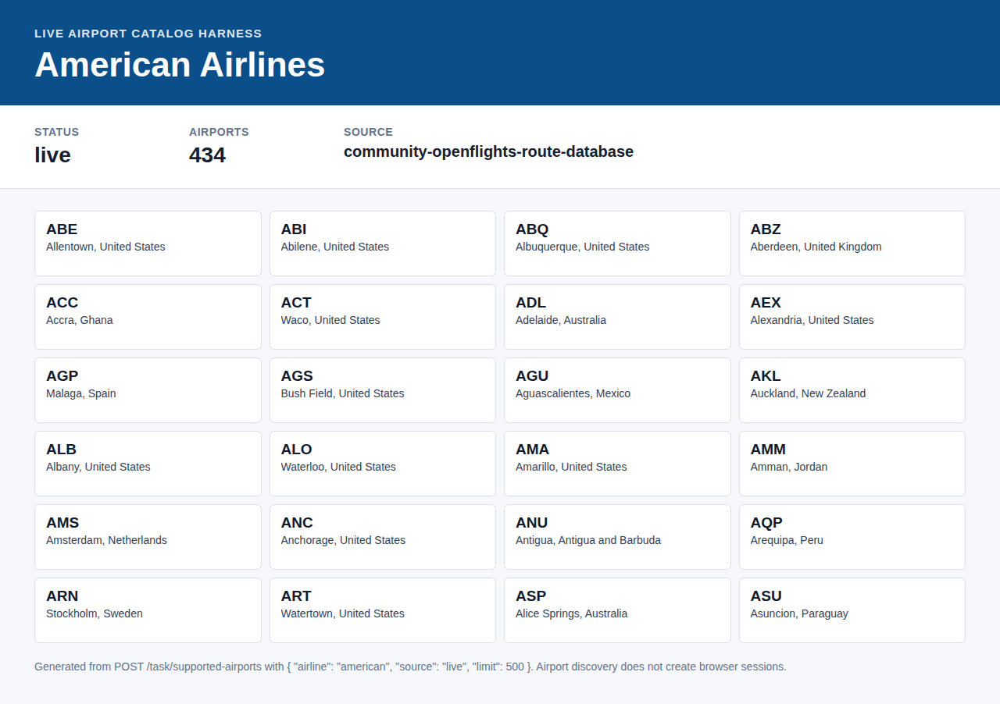

# american JFK-LAX
Confirmed working example for american on JFK-LAX, departing 2026-07-23.
- Response: `find-jfk-lax-2026-07-23.response.json`
- Screenshot: `screenshot.png`
- Cheapest returned price: 277 USD
- Returned flights/options: 10

The screenshot is captured by the harness with cookie banners accepted before capture. Route-offer pages can contain published indicative fares; exact live checkout prices still require the airline booking flow to complete.

## Live Airport Catalog

Confirmed live airport catalog example for American Airlines.

- Endpoint: `POST /task/supported-airports`
- Request body: `{"airline":"american","source":"live","limit":500}`
- Response: `supported-airports-live.response.json`
- Screenshot: `supported-airports-live.screenshot.png`
- Airports returned: 434
- Catalog source: `community-openflights-route-database`

Airport catalog discovery does not create a browser or FlareSolverr session. Use the response `data.diagnostics.american.source` as the provenance field when reporting the catalog source.
