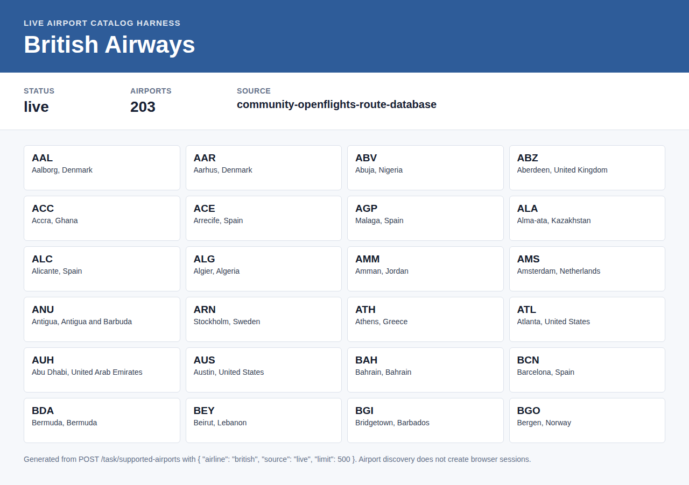

# British Airways Examples

British Airways currently has a live airport catalog example. Public pricing screenshots are not included here because previous artifact-generation retries hit a FlareSolverr challenge timeout. The harness still returns structured diagnostics for British Airways pricing attempts.

## Live Airport Catalog

Confirmed live airport catalog example for British Airways.

- Endpoint: `POST /task/supported-airports`
- Request body: `{"airline":"british","source":"live","limit":500}`
- Response: `supported-airports-live.response.json`
- Screenshot: `supported-airports-live.screenshot.png`
- Airports returned: 203
- Catalog source: `community-openflights-route-database`

Airport catalog discovery does not create a browser or FlareSolverr session. Use the response `data.diagnostics.british.source` as the provenance field when reporting the catalog source.
