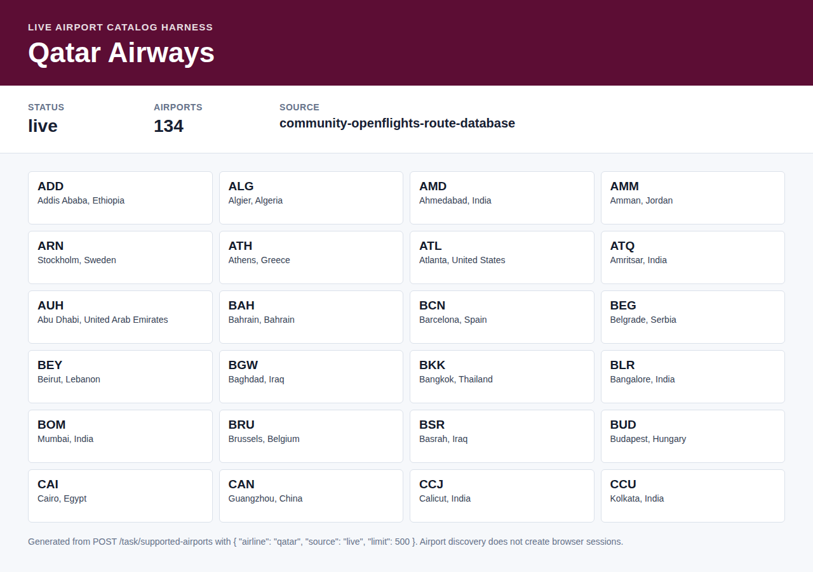

# qatar VIE-LHR

Confirmed working example for qatar on VIE-LHR, departing 2026-07-23.

- Response: `find-vie-lhr-2026-07-23.response.json`
- Screenshot: `screenshot.png`
- Cheapest returned price: 1193 EUR
- Returned flights/options: 14

The screenshot is rendered from the FlareSolverr-resolved Qatar Airways HTML that produced the fare extraction, with the static cookie overlay removed before capture. Exact live checkout prices still require the airline booking flow to complete.

## Live Airport Catalog

Confirmed live airport catalog example for Qatar Airways.

- Endpoint: `POST /task/supported-airports`
- Request body: `{"airline":"qatar","source":"live","limit":500}`
- Response: `supported-airports-live.response.json`
- Screenshot: `supported-airports-live.screenshot.png`
- Airports returned: 134
- Catalog source: `community-openflights-route-database`

Airport catalog discovery does not create a browser or FlareSolverr session. Use the response `data.diagnostics.qatar.source` as the provenance field when reporting the catalog source.
