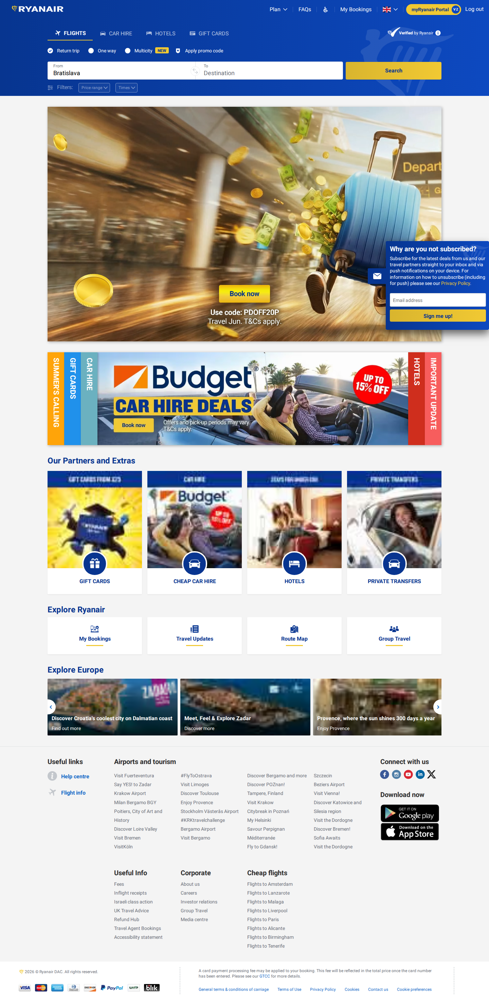
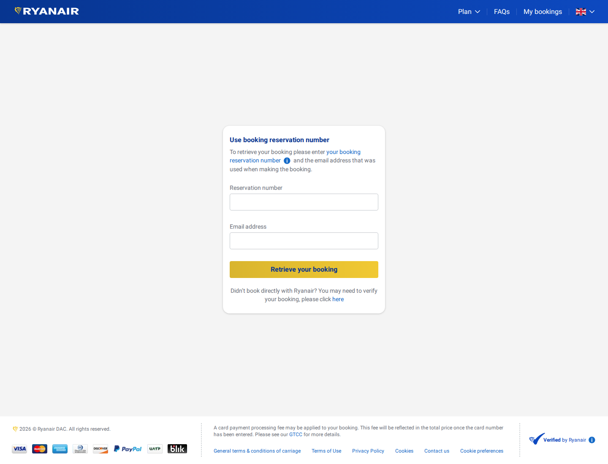

# Ryanair Examples

This folder documents each implemented Ryanair harness skill with a sanitized response and screenshot where the task has a visual state. Login and bookings screenshots are sanitized illustrative captures that use placeholders. Runtime credentials, verification codes, booking references, cookies, and account identifiers must not be committed.

## Flight Pricing

Confirmed working example for Ryanair on VIE-STN, departing 2026-07-23.

- Response: `find-vie-stn-2026-07-23.response.json`
- Screenshot: `find-vie-stn-2026-07-23.screenshot.png`
- Cheapest returned price: 56 EUR
- Returned flights/options: 1


The screenshot is captured by the harness with cookie banners accepted before capture. Route-offer pages can contain published indicative fares; exact live checkout prices still require the airline booking flow to complete.

## Runtime Login Example

Ryanair login is driven through `POST /task/login`. Credentials are passed only at runtime and must never be committed to examples, screenshots, docs, tests, or logs.

PowerShell:

```powershell
$password = Read-Host "Ryanair password" -AsSecureString
.\scripts\login-airline.ps1 -Airline ryanair -Username "user@example.com" -Password $password -Locale "gb/en"
```

HTTP:

```bash
curl -X POST http://localhost:8787/task/login \
  -H 'content-type: application/json' \
  -d '{"airline":"ryanair","username":"user@example.com","password":"runtime-secret","locale":"gb/en"}'
```

- Request: `login-verification-required.request.json`
- Response: `login-verification-required.response.json`
- Screenshot: `login-verification-required.screenshot.png`
- Successful login response: `login-success.response.json`
- Successful login screenshot: `login-success.screenshot.png`




This example uses the placeholder username `user@example.com`. Real usernames, passwords, and verification codes are runtime-only values and are not returned by the harness.

When Ryanair asks for device or email verification, the harness returns `authenticated: false`, `diagnostics.reason = "verification_required"`, and a short-lived `diagnostics.challengeId`. Agents should read the fresh code with an authorized Gmail-capable tool or ask the human user for it, then call `POST /task/submit-verification-code` with that `challengeId`. If the continuation response is `authenticated: true`, continue with the authenticated task using the harness rather than manual browser clicks.

## Active Bookings Example

Ryanair active/current and past bookings are driven through `POST /task/list-bookings`. This is an authenticated runtime task; no real account data is committed.

PowerShell:

```powershell
$password = Read-Host "Ryanair password" -AsSecureString
.\scripts\list-bookings.ps1 -Airline ryanair -Username "user@example.com" -Password $password -Locale "gb/en" -IncludeScreenshot
```

Use `-AllBookings` to request current plus past booking state:

```powershell
.\scripts\list-bookings.ps1 -Airline ryanair -Username "user@example.com" -Password $password -Locale "gb/en" -AllBookings -IncludeScreenshot
```

If Ryanair requires email/device verification, the agent should read the fresh code through a separate Gmail-capable tool or ask the human user, then continue the same browser session with the returned `challengeId`:

```powershell
.\scripts\submit-verification-code.ps1 -Airline ryanair -ChallengeId "ryanair-verification-..." -VerificationCode "12345678"
```

- Request: `list-bookings-verification-required.request.json`
- Response: `list-bookings-verification-required.response.json`
- Continuation request: `submit-verification-code.request.json`
- Screenshot: `list-bookings-verification-required.screenshot.png`
- Successful post-login all-bookings response: `list-bookings-success.response.json`
- Successful post-login all-bookings screenshot: `list-bookings-success.screenshot.png`




The successful post-login example shows the actual state Ryanair returned for this account: the all-bookings/check-in page loaded, but Ryanair displayed the booking retrieval form instead of current or past booking cards. The harness reports this as `bookingListState: "retrieve_booking_form"` and returns an empty `data.bookings` array rather than inventing bookings from page labels.

## myRyanair Portal Review Example

`POST /task/manage-portal` navigates to authenticated myRyanair sections and returns section headings, field labels, and available actions. It does not submit account changes.

PowerShell:

```powershell
$password = Read-Host "Ryanair password" -AsSecureString
.\scripts\manage-ryanair-portal.ps1 -Username "user@example.com" -Password $password -Section travel_documents
```

Supported sections are `personal_information`, `travel_documents`, `companions`, `wallet`, and `bookings`.

- Request: `manage-portal-travel-documents.request.json`
- Response: `manage-portal-travel-documents.response.json`

Real portal screenshots can contain personal account data, so this example intentionally commits only sanitized JSON. Runtime callers can pass `includeScreenshot: true` and keep the artifact outside the repository.
