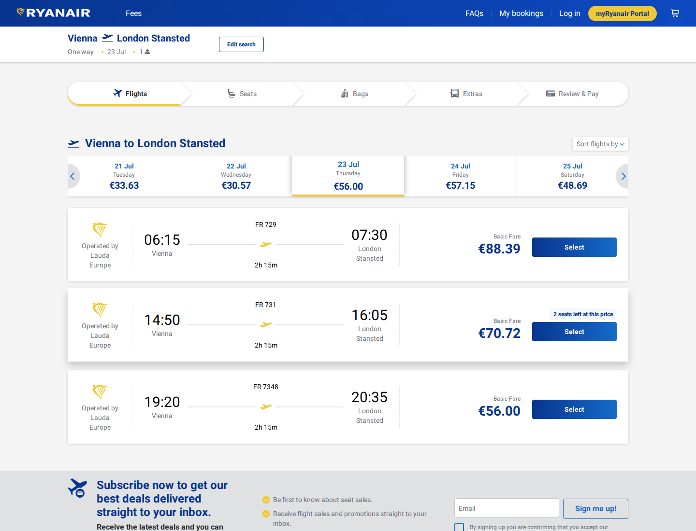

# ryanair VIE-STN
Confirmed working example for ryanair on VIE-STN, departing 2026-07-23.
- Response: `find-vie-stn-2026-07-23.response.json`
- Screenshot: `screenshot.png`
- Cheapest returned price: 56 EUR
- Returned flights/options: 1



The screenshot is captured by the harness with cookie banners accepted before capture. Route-offer pages can contain published indicative fares; exact live checkout prices still require the airline booking flow to complete.

## Runtime Login Example

Ryanair login is driven through `POST /task/login`. Credentials are passed only at runtime and must never be committed to examples, screenshots, docs, tests, or logs.

PowerShell:

```powershell
$password = Read-Host "Ryanair password" -AsSecureString
.\scripts\login-airline.ps1 -Airline ryanair -Username "user@example.com" -Password $password -Locale "gb/en"
```

HTTP:

```bash
curl -X POST http://localhost:8787/task/login \
  -H 'content-type: application/json' \
  -d '{"airline":"ryanair","username":"user@example.com","password":"runtime-secret","locale":"gb/en"}'
```

Example sanitized response: `login-verification-required.response.json`.

When Ryanair asks for device or email verification, the harness returns `authenticated: false` with `diagnostics.reason` set to `verification_required`. Agents should report that state and stop; they should not loop retries or ask the harness to keep submitting credentials. If the response is `authenticated: true`, continue with the authenticated task using the harness rather than manual browser clicks.
