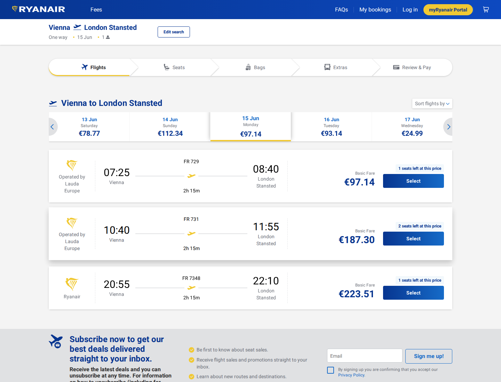

# Ryanair Price Discovery Example

This example shows a single harness call that found a Ryanair fare from Vienna to London Stansted.

Request:

```bash
curl -X POST http://localhost:8787/task/find-flights \
  -H 'content-type: application/json' \
  -d '{"airline":"ryanair","origin":"VIE","destination":"STN","dateOut":"2026-06-15","adults":1,"currency":"EUR","includeScreenshot":true}'
```

Result summary:

- Route: `VIE` to `STN`
- Date: `2026-06-15`
- Departure: `07:25`
- Arrival: `08:40`
- Price: `97.14 EUR`
- Source: Ryanair fare-finder API

The full response is in [find-vie-stn-2026-06-15.response.json](find-vie-stn-2026-06-15.response.json).

Screenshot captured by the optional screenshot flow:


