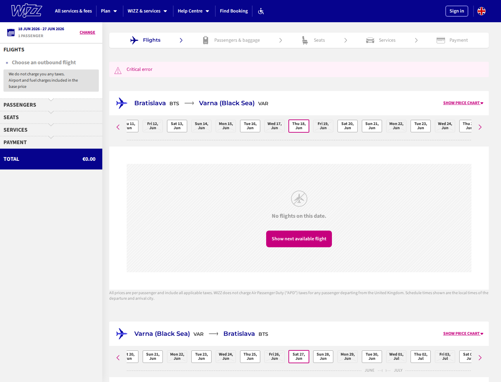
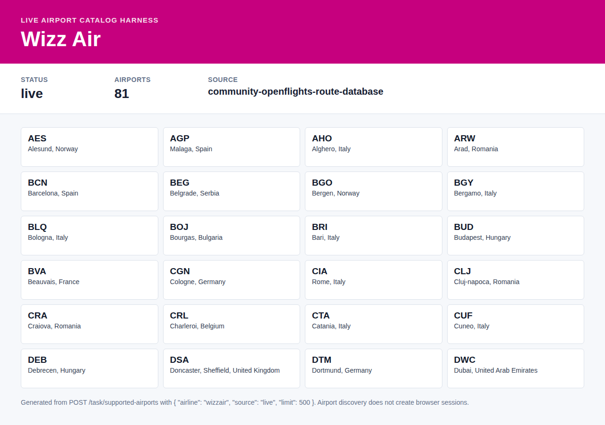

# wizzair BTS-VAR
Confirmed working example for wizzair on BTS-VAR, departing 2026-06-18.
Return date: 2026-06-27.
- Response: `find-bts-var-2026-06-18.response.json`
- Screenshot: `screenshot.png`
- Exact outbound price: 35.99 EUR
- Exact return price: 39.99 EUR
- Cheapest returned calendar price: 17.99 EUR
- Returned flights/options: 21

The screenshot is captured by the harness with cookie banners accepted before capture. Route-offer pages can contain published indicative fares; exact live checkout prices still require the airline booking flow to complete.

## Live Airport Catalog

Confirmed live airport catalog example for Wizz Air.

- Endpoint: `POST /task/supported-airports`
- Request body: `{"airline":"wizzair","source":"live","limit":500}`
- Response: `supported-airports-live.response.json`
- Screenshot: `supported-airports-live.screenshot.png`
- Airports returned: 81
- Catalog source: `community-openflights-route-database`

Airport catalog discovery does not create a browser or FlareSolverr session. Use the response `data.diagnostics.wizzair.source` as the provenance field when reporting the catalog source.
